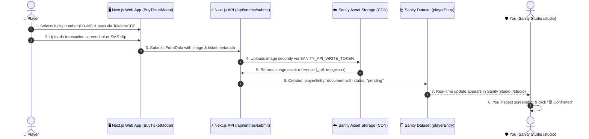

# Sanity CMS Structure & Strategy: Player Screenshot Verification Guide

> **Purpose:** Step-by-step documentation on how player payment screenshots are submitted from the website and how you view, inspect, and approve them inside Sanity Studio.

---

## 1. Overview of the Submission & Review Pipeline



---

## 2. Sanity Schema Structure (`playerEntryType`)

The document schema is located at [`frontend/sanity/schemaTypes/playerEntry.ts`](file:///Users/zemichaeltefera/Documents/GitHub/lottery-game/frontend/sanity/schemaTypes/playerEntry.ts).

### 2.1 Grouped Fieldsets in Sanity Studio
When you open an entry in Sanity Studio, all data is organized into 4 clear collapsible cards:

```
┌─────────────────────────────────────────────────────────────────┐
│ 👤 PLAYER INFORMATION                                           │
│ • Player Name: Zemichael Tefera                                 │
│ • Player Phone: +251 911 234 567                                │
├─────────────────────────────────────────────────────────────────┤
│ 🎟️ TICKET & DRAW DETAILS                                        │
│ • Draw ID: RDL-ETB-500-2K                                       │
│ • Selected Lucky Number: #42                                    │
│ • Pool Capacity: 2,000 (2K) People                              │
│ • Amount Paid: 500 ETB                                          │
│ • Submission Timestamp: 2026-09-01T02:15:00Z                   │
├─────────────────────────────────────────────────────────────────┤
│ 💳 PAYMENT & SCREENSHOT VERIFICATION                            │
│ • Payment Method: Telebirr SuperApp / CBE Birr                  │
│ • 📸 Payment Screenshot: [ ZOOMABLE IMAGE PREVIEW ]            │
├─────────────────────────────────────────────────────────────────┤
│ 🔧 ADMIN REVIEW & APPROVAL                                      │
│ ( ) 🟡 Pending (Needs Verification)                             │
│ (•) 🟢 Confirmed & Approved (Valid Ticket)                      │
│ ( ) 🔴 Rejected (Fake/Duplicate Proof)                          │
│ • Admin Review Notes: "Telebirr TxID 9KL8839 verified."         │
└─────────────────────────────────────────────────────────────────┘
```

### 2.2 Schema Definition Highlights
- **Document Type**: `playerEntry`
- **Screenshot Image Field**: `proofScreenshot` (`type: "image"`, `options: { hotspot: true }`). Allows instant high-resolution zoom and click-to-preview.
- **Status Field**: `status` (Radio options: `pending`, `confirmed`, `rejected`).
- **Sidebar List Preview**: Formatted with emoji badges, the player's lucky number, name, phone, and a **thumbnail of the screenshot** so you can scan receipts at a glance.

---

## 3. How to View & Manage Receipts in Sanity Studio

### Step 1: Open Sanity Studio
Navigate to `http://localhost:3000/studio` in your browser (or your deployed domain `/studio`).

### Step 2: Access the Receipts Section
In the left sidebar of Sanity Studio, click on **"Ticket Entry & Payment Screenshot"** (or `playerEntry`).

### Step 3: Inspect the Screenshot
- The list will display all submitted tickets with live thumbnail images.
- Pending receipts are marked with `🟡 [PENDING]`.
- Click on any document to view the full details.
- Click on the **Payment Screenshot image** to inspect the Telebirr / CBE transaction text, timestamp, amount, and sender name.

### Step 4: Approve or Reject
1. Check that the amount on the screenshot matches the ticket price (e.g. `500 ETB`).
2. Switch the **Verification Status** radio from `🟡 Pending` to:
   - `🟢 Confirmed & Approved` (if valid)
   - `🔴 Rejected` (if duplicate or invalid)
3. (Optional) Add a note in **Admin Review Notes** (e.g., `Telebirr TxID: 884729 confirmed`).
4. Click **Publish** at the bottom right.

---

## 4. Secure API Route & Token Strategy

### 4.1 Server-Side Write Token Protection
To prevent users from tampering with Sanity or writing arbitrary data:
- The frontend browser **never receives the Sanity Write Token**.
- Submissions are sent to the Next.js API route: [`/api/entries/submit`](file:///Users/zemichaeltefera/Documents/GitHub/lottery-game/frontend/app/api/entries/submit/route.ts).
- The Next.js API route validates the input, uses the server-side environment variable `SANITY_API_WRITE_TOKEN`, uploads the image file to Sanity CDN, and writes the `playerEntry` document.

### 4.2 Required Environment Variables
Ensure these keys are present in [`frontend/.env.local`](file:///Users/zemichaeltefera/Documents/GitHub/lottery-game/frontend/.env.local):

```ini
# Sanity Project Configuration
NEXT_PUBLIC_SANITY_PROJECT_ID=your_project_id
NEXT_PUBLIC_SANITY_DATASET=production
NEXT_PUBLIC_SANITY_API_VERSION=2024-03-01

# Server-Side Write Token (Required for image upload & entry creation)
SANITY_API_WRITE_TOKEN=sk...your_sanity_write_token...
```

> **How to create a Write Token in Sanity:**
> 1. Go to [manage.sanity.io](https://manage.sanity.io).
> 2. Select your project $\rightarrow$ **API** $\rightarrow$ **Tokens** $\rightarrow$ **Add API token**.
> 3. Name it `Lottery Backend Write` and give it **Editor** permissions.
> 4. Paste the token into `SANITY_API_WRITE_TOKEN` in `.env.local`.

---

## 5. Offline Fallback Strategy
If Sanity is temporarily unreachable or the write token is not yet configured:
- The website automatically saves the submitted ticket and screenshot to the user's browser `localStorage`.
- The user immediately sees their ticket under [`/entries`](file:///Users/zemichaeltefera/Documents/GitHub/lottery-game/frontend/app/entries/page.tsx) ("My Tickets") with a `🟡 Pending Verification` badge.
- As soon as the API is connected, submissions flow directly into Sanity Studio.
