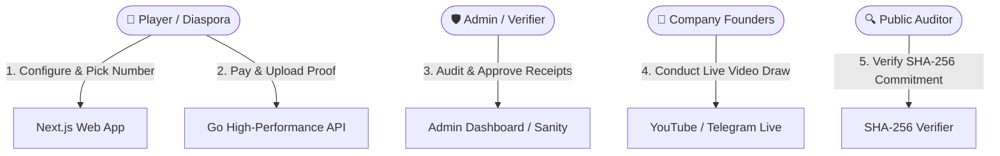

# Rimna International Digital Lottery — Comprehensive System Specification & Architecture

> **Document Version:** 1.0.0  
> **Date:** September 2026  
> **Platform Name:** Rimna International Digital Lottery (RIMNA)  
> **Primary Domains:** Ethiopia (Local ETB) & Global Diaspora (USD)

---

## 1. Executive Summary & Vision

### 1.1 The Core Mission
Traditional and digital lotteries across developing markets suffer from two fundamental problems:
1. **Lack of Transparency**: Unauditable digital algorithms ("black boxes") where users question whether real winners exist.
2. **Complexity and Low Odds**: Uncapped, nationwide lotteries with millions of participants where an individual's chances of winning are virtually zero (e.g. 1 in 10,000,000).

**Rimna International Digital Lottery (RIMNA)** disrupts this model through **Simplicity, Capped Pools, and 100% Live Video Transparency**:
- **Capped Participant Pools**: Draws close at fixed sizes (1K, 2K, 3K, or 5K tickets).
- **High Winning Odds**: 10 guaranteed winners in every pool (e.g., **1 in 100 odds** for a 1,000-person pool).
- **Public Video Broadcasts**: Company founders physically conduct draws on live video (YouTube & Telegram) with zero hidden automation.
- **Cryptographic Fairness**: SHA-256 commit-reveal seeds published before tickets are sold, allowing independent verification.
- **Dual Currency Architecture**: Seamless local payment via Telebirr & CBE Birr, alongside USD support for the global Ethiopian diaspora.

---

## 2. Game Mechanics & Mathematical Model

### 2.1 The 3-Step Selection Flow
The user journey is built around a frictionless interactive ticket builder:
$$\text{Currency} \longrightarrow \text{Ticket Price} \longrightarrow \text{Participant Pool Size}$$

```
   ┌────────────────────────────────────────────────────────┐
   │                    1. SELECT CURRENCY                  │
   │            [ ETB (Birr) · Local ]   [ USD ($) · Diaspora ]│
   └───────────────────────────┬────────────────────────────┘
                               │
   ┌───────────────────────────▼────────────────────────────┐
   │                    2. TICKET PRICE                     │
   │        ETB: 100 ETB │ 200 ETB │ 500 ETB │ 1,000 ETB     │
   │        USD:  $25    │  $50    │  $100   │   $250       │
   └───────────────────────────┬────────────────────────────┘
                               │
   ┌───────────────────────────▼────────────────────────────┐
   │                 3. PARTICIPANT POOL                    │
   │             1K (1,000) │ 2K (2,000) │ 3K (3,000) │ 5K   │
   └───────────────────────────┬────────────────────────────┘
                               │
   ┌───────────────────────────▼────────────────────────────┐
   │          DYNAMIC REWARD POOL & GUARANTEED 10 WINNERS   │
   │    Total Pool = Ticket Price × Pool Size (100% Payout) │
   └────────────────────────────────────────────────────────┘
```

### 2.2 Mathematical Formulas

1. **Total Prize Pool Formula**:
   $$\text{TotalPrizePool} = \text{TicketPrice} \times \text{PoolCapacity}$$

   *Example (500 ETB price, 2,000 pool)*:
   $$\text{TotalPrizePool} = 500 \times 2,000 = 1,000,000\text{ ETB}$$

2. **Winning Odds Formula**:
   $$\text{Odds of Winning Any Prize} = \frac{10}{\text{PoolCapacity}} = \frac{1}{\text{PoolCapacity} / 10}$$

   | Pool Size | Guaranteed Winners | Odds of Winning |
   | :--- | :---: | :---: |
   | **1,000 (1K)** | 10 Winners | **1 in 100** |
   | **2,000 (2K)** | 10 Winners | **1 in 200** |
   | **3,000 (3K)** | 10 Winners | **1 in 300** |
   | **5,000 (5K)** | 10 Winners | **1 in 500** |

3. **Guaranteed Prize Distribution (10 Ranks — 100% Payout)**:
   Every draw guarantees payouts across 10 distinct winning ranks:

   | Rank | Tier Name | % of Total Pool | Example (100K ETB Pool) | Example (1M ETB Pool) |
   | :---: | :--- | :---: | :---: | :---: |
   | **#1** | **Grand Jackpot** | **30%** | **30,000 ETB** | **300,000 ETB** |
   | **#2** | **2nd Prize (Luxury)** | **20%** | **20,000 ETB** | **200,000 ETB** |
   | **#3** | **3rd Prize (High Cash)** | **15%** | **15,000 ETB** | **150,000 ETB** |
   | **#4** | 4th Prize | 10% | 10,000 ETB | 100,000 ETB |
   | **#5** | 5th Prize | 7% | 7,000 ETB | 70,000 ETB |
   | **#6** | 6th Prize | 5% | 5,000 ETB | 50,000 ETB |
   | **#7** | 7th Prize | 4% | 4,000 ETB | 40,000 ETB |
   | **#8** | 8th Prize | 3% | 3,000 ETB | 30,000 ETB |
   | **#9** | 9th Prize | 3% | 3,000 ETB | 30,000 ETB |
   | **#10** | 10th Prize | 3% | 3,000 ETB | 30,000 ETB |
   | **TOTAL** | **10 Winners** | **100%** | **100,000 ETB** | **1,000,000 ETB** |

---

## 3. Platform Actors & Roles



### 3.1 Actors Table

| Actor | Responsibilities | Key Touchpoints |
| :--- | :--- | :--- |
| **Player (Local ETB)** | Selects ticket price & pool, picks lucky numbers (00–99), pays via Telebirr or CBE, uploads transaction screenshot. | Web App, `/entries`, Live Stream |
| **Player (Diaspora USD)** | Plays via international debit/credit or remittance wire in USD, receives payouts via global wire or remittance. | Web App, USD Currency Toggle |
| **Admin Operator** | Reviews pending payment screenshots against merchant ledger, approves/rejects entries, manages draw schedules. | `/admin/dashboard`, `/studio` |
| **Company Founders** | Broadcasts live draw video, spins physical tumbler, announces winners on camera. | Telegram / YouTube Live |
| **Public Auditor** | Independently calculates SHA-256 seeds and verifies cryptographic commitment hashes. | `/results`, Cryptographic Audit Tool |

---

## 4. Frontend Architecture & Design System

### 4.1 Technology Stack
- **Framework**: Next.js 14 (App Router, Server Components & Client Components)
- **Language**: TypeScript with strict typing
- **Styling**: Vanilla CSS Design System with CSS variables (`globals.css`)
- **CMS**: Sanity Studio v3 (`/studio`) for instant marketing copy, hero banners, and dynamic draw parameters
- **Icons**: Lucide React
- **Internationalization**: Trilingual support (`en` English, `am` Amharic, `om` Afaan Oromoo)

### 4.2 Design System Tokens
- **Theme**: Luxury Casino Gold & Rough Cream Paper Raffle Aesthetic
- **Color Palette**:
  - Surface Background: `#FFFDF5` (Warm cream raffle paper)
  - Golden Accents: `#F59E0B` (Amber gold border), `#FEF08A` (Light gold pill), `#FEF9C3` (Active card background), `#854D0E` (Deep gold text)
  - Primary Casino CTA: `.casino-btn-red` (`#DC2626` / `#B91C1C` with bevel shadow)
  - Status Indicators: `#059669` / `#ECFDF5` (Approved/Capacity green), `#D97706` (Pending gold)
  - Deep Contrast: `#111827` (Dark slate header typography)

### 4.3 Page Hierarchy
1. **`/` (Home)**:
   - Official Unobstructed Panoramic Hero Banner (`RIMNA INTERNATIONAL DIGITAL LOTTERY`).
   - Quick-Action & Countdown bar (`Live Draw In: DD:HH:MM:SS`, `Choose & Buy Ticket ↓`, `How It Works`).
   - Centerpiece **Interactive Ticket Configurator** with equal desktop vertical alignment.
   - Testimonials & Trust Badges.
2. **`/how-it-works` (Comprehensive Player Guide)**:
   - 4-step detailed guide explaining selection, phone login, live draws, and instant payouts.
3. **`/results` (Live & Past Audited Results)**:
   - Live stream video player, winning numbers breakdown, winner payout confirmations, SHA-256 verifier.
4. **`/entries` (My Tickets Dashboard)**:
   - Phone-authenticated personal dashboard tracking chosen numbers, transaction status (🟡 Pending / 🟢 Approved), and draw countdowns.
5. **`/studio` (Sanity CMS Studio)**:
   - Admin content manager for banners, draws, FAQs, translations, and proof submissions.

---

## 5. Backend Architecture in Go (Golang)

### 5.1 Architecture Overview (Clean Modular Architecture)
The backend is structured using Go best practices for ultra-low latency, concurrent connection handling, and rock-solid transaction safety:

```
backend/
├── cmd/
│   └── server/
│       └── main.go                 # Application bootstrap & dependency injection
├── internal/
│   ├── domain/                     # Core Business Domain Entities
│   │   ├── draw.go                 # Draw & Pool entity models
│   │   ├── entry.go                # Ticket Entry entity models
│   │   ├── user.go                 # User entity & Auth models
│   │   └── transaction.go          # Payment Transaction models
│   ├── usecase/                    # Pure Business Logic Layer
│   │   ├── draw_uc.go              # Create draw, close pool, compute winners
│   │   ├── ticket_uc.go            # Ticket purchase, number allocation
│   │   └── payment_uc.go           # Payment verification & receipt approval
│   ├── repository/                 # Database Persistence Layer
│   │   └── postgres/               # PostgreSQL queries with pgx/sqlx
│   │       ├── draw_repo.go
│   │       ├── entry_repo.go
│   │       └── user_repo.go
│   ├── delivery/                   # Interface Adapters
│   │   ├── http/                   # REST API Handlers & Routing (Gin / Fiber)
│   │   │   ├── draw_handler.go
│   │   │   ├── entry_handler.go
│   │   │   └── middleware/         # JWT Auth, Rate Limiter, CORS, Audit Logger
│   │   └── ws/                     # WebSocket Hub (Live countdowns & pool capacity)
│   └── worker/                     # Asynchronous Background Workers
│       ├── draw_scheduler.go       # Auto-closes draws upon deadline/pool cap
│       └── notify_worker.go        # SMS & Telegram winner notification sender
└── pkg/
    ├── crypto/                     # SHA-256 Commit-Reveal generator & verifier
    └── storage/                    # S3 / Cloudinary receipt upload client
```

### 5.2 Go REST API Endpoints

#### Public Player Routes
- `GET  /api/v1/draws/active` — Returns current open draws with active pool capacities.
- `GET  /api/v1/draws/:id/availability` — Returns taken and available ticket numbers (00–99).
- `POST /api/v1/entries/purchase` — Creates a pending ticket entry with payment receipt upload.
- `GET  /api/v1/entries/my-tickets` — Fetches all tickets belonging to authenticated phone number.
- `GET  /api/v1/results/latest` — Returns winning numbers, prize amounts, and live video URL.
- `GET  /api/v1/results/verify/:draw_id` — Verifies SHA-256 seed commitment.

#### Admin & Operator Routes
- `POST /api/v1/admin/auth/login` — Admin authentication.
- `GET  /api/v1/admin/entries/pending` — Lists pending screenshot receipts.
- `POST /api/v1/admin/entries/:id/review` — Approves or rejects a player entry with reason.
- `POST /api/v1/admin/draws/:id/execute` — Publishes winning numbers, reveals seed, and assigns winners.
- `POST /api/v1/admin/draws/:id/payout` — Records payout confirmation reference.

---

## 6. PostgreSQL Database Schema & Strategy

### 6.1 Database Strategy & ACID Concurrency
- **Concurrency Control**: To prevent two users from buying the same number or exceeding pool capacity simultaneously, all purchase operations use PostgreSQL row-level locks:
  ```sql
  SELECT current_tickets, pool_capacity FROM draws WHERE id = $1 FOR UPDATE;
  ```
- **Idempotent Transactions**: All payment receipts are hashed (`receipt_image_hash`) with unique constraints to prevent duplicate proof submission.

### 6.2 DDL Schema (PostgreSQL 15+)

```sql
-- 1. USERS TABLE
CREATE TABLE users (
    id UUID PRIMARY KEY DEFAULT gen_random_uuid(),
    phone_number VARCHAR(20) NOT NULL UNIQUE,
    full_name VARCHAR(100),
    email VARCHAR(100),
    role VARCHAR(20) DEFAULT 'player' CHECK (role IN ('player', 'admin', 'operator', 'auditor')),
    created_at TIMESTAMP WITH TIME ZONE DEFAULT NOW(),
    updated_at TIMESTAMP WITH TIME ZONE DEFAULT NOW()
);

CREATE INDEX idx_users_phone ON users(phone_number);

-- 2. DRAWS TABLE
CREATE TABLE draws (
    id UUID PRIMARY KEY DEFAULT gen_random_uuid(),
    draw_code VARCHAR(30) NOT NULL UNIQUE,          -- e.g. 'RDL-ETB-500-2K'
    title VARCHAR(200) NOT NULL,
    currency VARCHAR(5) NOT NULL CHECK (currency IN ('ETB', 'USD')),
    ticket_price NUMERIC(12, 2) NOT NULL,
    pool_capacity INT NOT NULL CHECK (pool_capacity IN (1000, 2000, 3000, 5000)),
    current_tickets INT DEFAULT 0,
    status VARCHAR(20) DEFAULT 'open' CHECK (status IN ('draft', 'open', 'closed', 'completed', 'cancelled')),
    deadline TIMESTAMP WITH TIME ZONE NOT NULL,
    commitment_hash VARCHAR(64) NOT NULL,           -- SHA-256 commitment hash
    revealed_seed VARCHAR(128),                     -- Revealed publicly after draw
    live_video_url VARCHAR(255),                    -- YouTube / Telegram stream URL
    created_at TIMESTAMP WITH TIME ZONE DEFAULT NOW(),
    updated_at TIMESTAMP WITH TIME ZONE DEFAULT NOW()
);

CREATE INDEX idx_draws_status ON draws(status);

-- 3. TICKET ENTRIES TABLE
CREATE TABLE ticket_entries (
    id UUID PRIMARY KEY DEFAULT gen_random_uuid(),
    draw_id UUID NOT NULL REFERENCES draws(id) ON DELETE CASCADE,
    user_id UUID NOT NULL REFERENCES users(id) ON DELETE CASCADE,
    ticket_number VARCHAR(10) NOT NULL,             -- e.g. '42'
    currency VARCHAR(5) NOT NULL,
    amount_paid NUMERIC(12, 2) NOT NULL,
    payment_method VARCHAR(30) NOT NULL,            -- 'telebirr', 'cbe_birr', 'wire', 'card'
    transaction_ref VARCHAR(100),
    screenshot_url TEXT NOT NULL,
    screenshot_hash VARCHAR(64),
    status VARCHAR(20) DEFAULT 'pending' CHECK (status IN ('pending', 'approved', 'rejected')),
    rejection_reason TEXT,
    verified_by UUID REFERENCES users(id),
    verified_at TIMESTAMP WITH TIME ZONE,
    created_at TIMESTAMP WITH TIME ZONE DEFAULT NOW(),
    updated_at TIMESTAMP WITH TIME ZONE DEFAULT NOW(),
    CONSTRAINT unique_draw_ticket_number UNIQUE (draw_id, ticket_number)
);

CREATE INDEX idx_entries_user ON ticket_entries(user_id);
CREATE INDEX idx_entries_draw_status ON ticket_entries(draw_id, status);

-- 4. DRAW WINNERS TABLE
CREATE TABLE draw_winners (
    id UUID PRIMARY KEY DEFAULT gen_random_uuid(),
    draw_id UUID NOT NULL REFERENCES draws(id) ON DELETE CASCADE,
    rank INT NOT NULL CHECK (rank BETWEEN 1 AND 10),
    winning_number VARCHAR(10) NOT NULL,
    prize_percentage NUMERIC(5, 2) NOT NULL,        -- e.g. 30.00
    prize_amount NUMERIC(14, 2) NOT NULL,           -- e.g. 300000.00
    winner_user_id UUID REFERENCES users(id),
    entry_id UUID REFERENCES ticket_entries(id),
    payout_status VARCHAR(20) DEFAULT 'pending' CHECK (payout_status IN ('pending', 'processing', 'paid', 'claimed')),
    payout_reference VARCHAR(100),
    paid_at TIMESTAMP WITH TIME ZONE,
    created_at TIMESTAMP WITH TIME ZONE DEFAULT NOW(),
    CONSTRAINT unique_draw_rank UNIQUE (draw_id, rank)
);

CREATE INDEX idx_winners_draw ON draw_winners(draw_id);

-- 5. AUDIT LOGS TABLE
CREATE TABLE audit_logs (
    id UUID PRIMARY KEY DEFAULT gen_random_uuid(),
    actor_id UUID REFERENCES users(id),
    action VARCHAR(50) NOT NULL,                    -- e.g. 'ENTRY_APPROVED', 'DRAW_COMPLETED'
    entity VARCHAR(50) NOT NULL,
    entity_id UUID NOT NULL,
    metadata JSONB,
    ip_address VARCHAR(45),
    created_at TIMESTAMP WITH TIME ZONE DEFAULT NOW()
);

CREATE INDEX idx_audit_created_at ON audit_logs(created_at);
```

---

## 7. Security, Provable Fairness & Verification

### 7.1 SHA-256 Commit-Reveal Scheme
To guarantee that winning outcomes are never rigged or manipulated:

1. **Commit Phase (Pre-Draw)**:
   - Before a draw opens for ticket sales, the server generates a cryptographically secure random 256-bit seed $S$.
   - The commitment hash $H = \text{SHA256}(S)$ is permanently stored in the database and published in the frontend UI.
2. **Draw Phase (Live Video Broadcast)**:
   - Company founders broadcast live on video.
   - Physical numbered balls are drawn from the tumbler machine on camera.
3. **Reveal Phase (Post-Draw)**:
   - The server publishes the unhashed seed $S$.
   - Any player or auditor can verify the commitment using standard SHA-256:
     $$\text{IsFair} = (\text{SHA256}(S) \stackrel{?}{=} H)$$

---

## 8. Deployment, Storage & Infrastructure Blueprint

```
┌─────────────────────────────────────────────────────────────────┐
│                    GLOBAL CLOUDFLARE CDN / EDGE                 │
└────────────────────────────────┬────────────────────────────────┘
                                 │
        ┌────────────────────────┴────────────────────────┐
        ▼                                                 ▼
┌───────────────────────────────┐         ┌───────────────────────────────┐
│   Next.js 14 Frontend Client  │         │   Go 1.22+ REST & WS Backend  │
│   Hosted on Vercel / Railway  │         │   Hosted on Docker / Linux VPS│
└───────────────┬───────────────┘         └───────────────┬───────────────┘
                │                                         │
        ┌───────┴────────────────────────┬────────────────┘
        ▼                                ▼
┌───────────────────────────────┐ ┌───────────────────────────────┐
│   Sanity.io Headless CMS      │ │   Managed PostgreSQL Database │
│   (Marketing & Site Settings) │ │   (ACID Transactions, Row-Lock│
└───────────────────────────────┘ └───────────────────────────────┘
```

- **Receipt Storage**: Player screenshot uploads are encrypted and stored in Amazon S3 / Cloudinary with pre-signed read URLs.
- **SMS & Notifications**: Telebirr Webhooks / Twilio / Africa's Talking API for instant ticket approval SMS alerts.
- **Monitoring & Observability**: Structured JSON logging in Go (`uber-go/zap`), Prometheus metrics, and Grafana health dashboards.

---

## 9. Conclusion & Roadmap

Rimna International Digital Lottery transforms the lottery landscape by replacing opaque systems with **verifiable transparency, capped pools, high winning odds, and physical founder live streams**. The architecture specified in this document guarantees performance, security, and effortless scalability across Ethiopia and the global diaspora.
