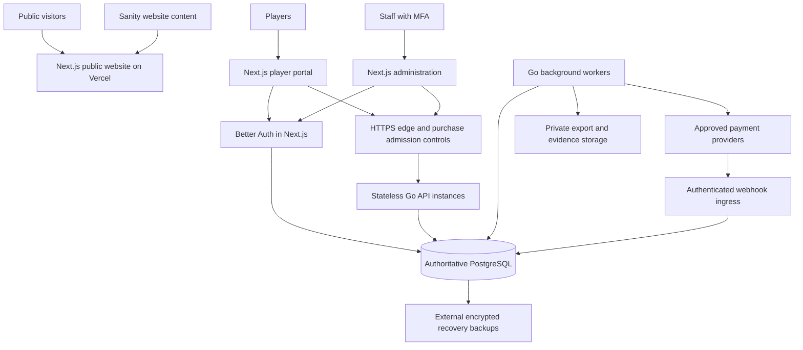

# Rimna — Admin Portal and Scalable Architecture

Implementation update (28 September 2026): the [templates and rounds increment](LOTTERY_ROUNDS_IMPLEMENTATION.md) is now locally verified. Wallets, independent draw approval and production acceptance remain planned.

Prepared: 28 September 2026  
Status: target design grounded in a limited source review. This is not a security certification, implementation completion report or production capacity measurement.

Track implementation and release evidence in the [Master Development and Release Checklist](DEVELOPMENT_CHECKLIST.md).

**Implementation increment — 28 September 2026:** The first responsive admin shell, protected overview/user directory and explicit existing-role access rules are now locally verified. See [Admin portal validation](ADMIN_PORTAL_VALIDATION.md) for actual coverage and remaining work. The target design below is still broader than the delivered increment.

## 1. Product rules and reference interpretation

Use the supplied administration screenshots for layout: a dark sidebar, clear page navigation, summary cards, searchable tables, detail views and exports. Preserve Rimna branding. Demo data and screenshot labels do not override confirmed business rules.

Rounds close at a fixed time and proceed using only sold, eligible lucky numbers. Prizes reflect actual eligible sales after disclosed deductions. One customer can win multiple prizes through different tickets. Prizes are paid outside the site and tracked as external settlements. There are no customer withdrawals or automatic prize credits to wallets in this phase. ETB and USD balances remain separate.

The prize rule for fewer than ten sold tickets, unused-deposit refunds and the USD funding provider remain unresolved. The client reiterated that the owner will ensure most tickets sell; preserve that expectation without substituting it for a defined financial rule. Warn staff when a round has fewer than ten eligible tickets. Do not substitute screenshot defaults for these decisions. See [the player specification](PLAYER_PORTAL_AND_TICKETING_SPEC.md).

## 2. Admin navigation and responsibilities

| Section | Functions | Required boundaries |
| --- | --- | --- |
| Overview | Sales and balances by currency, open rounds, outstanding prize obligations, payment exceptions, queue and service health | Distinguish customer balances, sales, operator revenue and prizes; never combine ETB and USD as one amount. Show data freshness. |
| Lotteries & rounds | Reusable lottery templates; create dated rounds; set price, currency, capacity, deductions, ranked prize shares and stream details; pause sales | Copy defaults into a versioned round. Editing template defaults affects future rounds only. Lock financial terms once sales begin. Validate percentages and rounding. |
| Draw management | Close and freeze the eligible register; export it for the live draw; enter ranked winning lucky numbers; review and publish results | Server checks deadline, eligibility and distinct winning tickets. Require a different authorized approver before publication. Retain the snapshot, video reference and correction history. |
| Manage users | Search, view separate balances and history, restrict account access, revoke sessions, manage staff grants | Permission-specific fields and actions. No plain balance editing, password viewing or unrestricted impersonation. Blocking sales access must not erase historical records or outstanding funds. |
| Financial review | Verified deposits, reconciliation exceptions, approved refund/adjustment workflows, external prize settlement records | Provider verification determines deposit credits. Staff cannot create money by marking a deposit paid. Corrections use balanced ledger entries with reasons and approval. |
| Identity review | Review only the verification information required by the agreed eligibility policy | Email verification and identity verification are separate statuses. Keep documents private with explicit reviewer access and retention rules; do not collect identity documents just to populate a tab. |
| Support | Account-linked cases, replies and internal notes | Support staff receive limited customer data and cannot grant roles, alter balances or publish results. Sanitize user-supplied content and attachments. |
| Reports & audit | Ledger, tickets, deposits, external prize payments, staff actions, sign-ins and downloadable reports | Currency-specific totals, restricted exports, access logs and immutable financial history. Large exports run in background jobs. |
| Content | Link to Sanity for website content and translations | CMS access never grants financial authority. Contact/subscriber data remains operational data with separately authorized export. |
| System operations | Pause sales, inspect backup jobs, recovery readiness, alerts and incident contacts | A normal admin requests a backup and sees its status. Production restore is a privileged, reviewed recovery procedure into an isolated target, not a one-click overwrite. |

Rename screenshot “phases” to “rounds” consistently unless the client prefers the original term. Replace “automatic” draw labels with “live draw — staff verified.” Remove withdrawal tabs. Commission/referral features shown in examples are not added without an explicit requirement. Existing legacy commission records must be preserved during migration.

## 3. Recommended application architecture

Use a **modular Go backend with PostgreSQL**, separate worker processes and **Next.js/TypeScript frontend modules**. Keep one repository and shared contracts while making public pages, player pages and administration separate feature areas. This allows focused changes without introducing distributed financial transactions across microservices.

The webhook ingress is a logical API route, not a mandatory extra microservice. Verify its origin and persist its work promptly. It must remain reachable during a sales pause or customer waiting-room admission. Apply provider-specific security and rate controls; it is not an unprotected bypass for customer purchases.

### Frontend boundaries

- Feature modules: authentication, wallets/deposits, lotteries, tickets, results, staff administration and operations. Share accessible form/table components and typed request/response contracts.
- Render/cache public CMS pages independently of the transaction system. Authenticated pages, balances and exports must not enter a shared public cache. Any local account cache is scoped by account/currency and cleared on logout or account switch.
- Use server-side session checks for protected entry points and a centralized data-access layer. Go still authorizes every protected API request; a hidden menu or frontend redirect is never an access control.
- The existing browser-to-Go client uses short-lived bearer tokens in memory, with Better Auth session cookies for authentication. Retain that boundary during incremental migration; do not store tokens in local storage. Any later server proxy must preserve user identity and authorization checks, not introduce a shared all-powerful admin credential.
- Use secure session cookies, origin/CSRF protection for cookie-authenticated mutations, safe output rendering and a tested Content Security Policy. Keep provider secrets, private data access and administrative credentials out of browser bundles.
- Paginate/search on the server. Virtualize number grids. Debounce availability reads and stop polling hidden tabs. Load only the current staff section, rather than downloading all users or all financial records at login.
- Provide accessible loading/error states and preserve purchase identifiers across uncertain retries. Never display a final purchase or available deposit balance before backend confirmation.

Next.js recommends checking authorization close to the data-access boundary rather than relying only on route-level UI checks. [Next.js authentication guide](https://nextjs.org/docs/app/guides/authentication).

### Backend modules and transactions

Separate identity/permissions, lottery templates and rounds, inventory/tickets, wallet ledger, deposits, purchases, results, prize settlements, reporting and operations. HTTP handlers validate and authorize; application services enforce workflows; PostgreSQL repositories perform atomic operations; adapters isolate payment, email and storage providers. Interfaces are useful at these boundaries, without wrapping every internal function.

Keep wallet debit, ticket ownership and purchase records in **one PostgreSQL transaction**. Check the account/currency balance, draw deadline and inventory using a consistent lock order. Use unique constraints for issued `(round_id, lucky_number)`, operation idempotency and verified provider transaction references. Ledger entries balance per currency; no mutation may bypass the ledger or spend an unavailable balance. Apply reversals rather than editing posted financial records.

Use brief database transactions, bounded batch sizes and bounded deadlock retries; never hold locks while contacting a payment provider. Automatic number assignment must be unbiased among available numbers and resistant to collisions near sellout. Profile its actual query/locking behavior rather than assuming a random full-table sort will scale.

PostgreSQL row locking is a building block for coordinating concurrent updates, but transaction design and constraints must enforce the complete business rules. [PostgreSQL locking documentation](https://www.postgresql.org/docs/current/explicit-locking.html).

Persist background work in the same transaction as its business event through an outbox/job table. Use durable leases, retries with backoff and deduplication. Workers may receive a job more than once, so effects must be idempotent. External uncertain charges or refunds require reconciliation, not a blanket promise of exactly-once execution across networks.

Build exports asynchronously into private storage. Capture a consistent reporting snapshot, sanitize spreadsheet formula cells, and authorize both job creation and download. Recheck permissions before issuing short-lived download access; record exports and expire artifacts. Sensitive identity files should use an authenticated download path where immediate revocation is required.

## 4. Staff security model

Proposed permissions should be explicit per action and resource:

| Role | Intended access |
| --- | --- |
| Owner/security administrator | Staff invitations, grants/revocations, incident controls and security settings; no ability to silently rewrite the ledger |
| Lottery operator | Prepare templates/rounds and enter draft results |
| Result approver | Independently review and publish a prepared draw result; cannot approve their own submission |
| Finance operator | Reconciliation, proposed adjustments/refunds and external settlement recording |
| Finance approver | Approve sensitive financial changes submitted by another authorized staff member |
| Support | Limited customer/ticket lookup and support cases |
| Auditor | Read-only, specifically authorized reports and audit history |
| Content editor | Sanity content permissions; no operational authority by default |

A small team can assign multiple roles to a person, but proposer/approver separation checks compare the actual person, not just role names. Decide staffing before enabling workflows that require two people. Emergency sales pause can be immediate with an audit event; recovery unlock and exceptional financial changes require stronger review.

Require verified staff accounts, completed MFA enrollment and actual second-factor sign-in, revocable sessions and fresh reauthentication for sensitive changes. Check MFA coverage for every enabled sign-in method and recovery path, not only whether a profile flag is set. Better Auth's documentation distinguishes enrollment from sign-in behavior and describes limitations for some non-credential sign-in methods. [Better Auth MFA documentation](https://better-auth.com/docs/plugins/2fa).

Default deny; validate current permission and object ownership on every request, including export/download endpoints. Never accept a client-provided staff role as authority. Restrict service/database accounts and separate migration/backup credentials from runtime credentials. These follow OWASP's authorization guidance. [OWASP authorization guidance](https://cheatsheetseries.owasp.org/cheatsheets/Authorization_Cheat_Sheet.html).

Log actor, action, target, time, request identifier, reason, approval and relevant safe changes. Exclude passwords, tokens, OTP secrets and full identity documents. Retain security/audit copies outside the application server with controlled retention. Application append-only logs are not tamper-proof against a host/database administrator; external retention makes interference more detectable.

## 5. One-VPS pilot and expansion

**Baseline:** Yegara 8 CPU / 16 GB RAM. Next.js remains on Vercel and content on Sanity. The proposed pilot VPS runs an HTTPS reverse proxy, one Go API process, a Go worker and PostgreSQL, with encrypted backups and private artifacts stored externally. This requires extending the current deployment configuration, which currently assumes an external database. Resource limits and connection budgets must be measured, leaving memory and disk headroom for the database and OS.

Better Auth currently runs in Next.js and connects to PostgreSQL. Vercel-to-database access needs an approved secure connectivity/pooling solution with TLS verification and restricted access. Do not expose PostgreSQL broadly to make serverless connectivity work. If restricted connectivity to VPS PostgreSQL is unavailable, move the auth runtime alongside the database or use a suitable managed database; this is a deployment decision to resolve before launch.

Use a waiting room with server-validated admission for purchases and protect against direct-origin bypass. Keep admitted sessions bounded, protect login from abuse separately, and allow history/results and authenticated provider callbacks under suitable independent limits. When capacity or providers are degraded, stop new financial activity cleanly and preserve already accepted work for reconciliation.

Scale based on measurements:

1. Move workers/export processing to another VPS when they compete with interactive traffic. Share private storage and the authoritative database; enforce global provider quotas across workers.
2. Add Go API instances behind a load balancer. Use shared session/rate-limit/admission state; increase aggregate database connections only within a measured budget. Local caches are advisory, never ticket ownership or wallet authority.
3. Give PostgreSQL dedicated resources or move to managed PostgreSQL. Rehearse migration and use a single authoritative writer. Replicas can serve suitable stale-tolerant reports, not purchase balance or ownership decisions.
4. Add database failover, redundant ingress and separately hosted application instances when the required uptime justifies them. Test failover and fence the old writer before promotion.

Redis can later support shared caches/rate limits, but is not required as an additional financial source of truth. Kubernetes and independently deployed microservices are not prerequisites for this pilot. Moving workers alone improves resource isolation; it does not remove a single database/server failure point.

No user-capacity number follows from CPU/RAM alone. Test burst arrivals, authenticated reads, number selection, deposits, purchases, draw closure and exports together. Report p95/p99 latency, completion/error rate, database lock/pool waits, queue time and provider lag. Publish only measured admission limits; 100,000 accounts is different from 100,000 simultaneous requests.

## 6. Recovery and operating controls

- Show last successful backup, archive age, last restore drill and measured recovery time separately. A successful upload is not evidence of recoverability.
- Keep encrypted external backups, independent key custody and tested retention. Add continuous database recovery if the agreed acceptable data-loss target requires it; existing logical snapshots alone do not provide that.
- Restore to an isolated target, revoke restored sessions and prevent writes until ledger/ticket counts and provider reconciliation pass. Reconcile external payments since the recovered point, fence the previous writer and record approval before reopening sales.
- Monitor API errors/latency, database health, queue age, unpaid prize obligations, provider exceptions, backup freshness and unexpected financial adjustments. Use private Prometheus/Grafana dashboards plus external uptime checks and routed alerts with named incident contacts.
- Keep global and per-round sales pause controls, distinct deposit controls and an emergency recovery lock. Pausing new purchases should not discard verified deposits or stop reconciliation. Failed or late deposit processing must remain visible.
- Deploy tested, versioned images with health checks and graceful draining. Use compatible staged schema migrations, staging data without production personal records, rollback rehearsals and dependency/security scanning.

## 7. What exists versus work still required

Source review on 28 September 2026 found the following. This was not an exhaustive security audit and did not rerun production or load tests.

| Area | Existing foundation | Work for this revised design |
| --- | --- | --- |
| Authentication | Better Auth email verification, MFA plugin, database-backed rate limits, short-lived tokens and backend session checks | Staff login/recovery acceptance, finer action permissions, recent-auth checks and sensitive-action approvals |
| Administration | A management dashboard, `admin`/`reviewer` roles and shared admin routes | Separate modules/screens, per-section read permissions, restricted user administration and approval workflows; current reviewer reads are broad |
| Purchases | Single-number orders, reservation constraints, idempotency and verified provider payments | Two-currency customer ledger, verified deposits, atomic bulk wallet purchases and automatic/manual number selection |
| Draws/results | Draw records and staff result publication checks | Reusable templates, versioned round rules, sold-only snapshots, dual approval, prize calculation and external settlement audit |
| Exports | Browser accumulates records and builds exports | Background snapshot exports, permission checks, download audit and private artifacts |
| Operations | API/worker separation, backpressure, metrics and backup/recovery helpers | Real admission control, deployed monitoring/alerts, external backups, recovery target validation and production networking |
| Capacity/security evidence | Prior local verification reports | Updated dependency review, adversarial workflow tests and measured acceptance on the selected VPS |

Relevant source: `frontend/lib/auth.ts`, `frontend/lib/account-api.ts`, `frontend/components/ManagementDashboard.tsx`, `backend/internal/httpapi/api.go`, `backend/internal/store/store.go`, `backend/migrations/001_core.sql`, and `backend/deploy/compose.yaml`. Earlier evidence and its limits are in [Operations validation](OPERATIONS_VALIDATION.md).

## 8. Implementation and release sequence

1. Finalize remaining prize/refund/provider rules; define permissions and versioned API contracts.
2. Implement and test the ledger, deposit lifecycle and bulk-ticket invariants before enabling balances in the portal.
3. Build player/admin feature modules and the frozen-register/live-result workflow.
4. Add approval controls, private background exports, operational dashboards and production admission controls.
5. Validate security, realistic traffic, financial reconciliation, restore and staff acceptance before a controlled launch.

Release tests must include cross-account and cross-role access attempts; same-wallet concurrent purchases; two buyers choosing one number; changed idempotency payloads; duplicated/late/out-of-order payment events; insufficient funds; deadline races; unsold winning-number rejection; repeated result approval; prohibited self-approval; currency isolation; private export access; and recovery reconciliation. Browser/mobile usability and authorization tests must cover all sensitive screens.

The design cannot guarantee an attack-free system. Implementation review, current dependency checks, production configuration, restoration evidence and an independent security review are needed before making security or capacity commitments. This expanded scope requires a revised delivery estimate; the prior direct-payment timeline is not automatically applicable.
