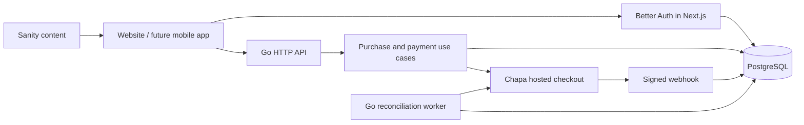

# Backend architecture

## Recommended approach

Use a **modular Go monolith**, a separate payment worker process built from the same code, and managed PostgreSQL. Keep Next.js on Vercel, including Better Auth’s TypeScript routes. This is simpler to operate than microservices and keeps ticket ownership and money changes in one database transaction. Separate services can follow measured bottlenecks; 25,000 registered buyers alone is not a reason for microservices.

Better Auth is not a Go library. Its official Next.js integration and JWT plugin allow the existing website to authenticate users while Go verifies signed, three-minute Ed25519 tokens. Go also checks the current database session on every authenticated request, so logout and password-reset revocation do not wait for JWT expiration. Staff access requires a local operator grant and enabled two-factor authentication.

## Boundaries

- `backend/internal/domain`: data types, errors, payment interface; no HTTP or database dependencies.
- `internal/service`: purchase orchestration and worker; depends on ports, not Chapa implementation.
- `internal/store`: PostgreSQL transactions, reservations, authorization lookup, operational reporting.
- `internal/payment/chapa`: API v2 hosted checkout, verification, raw-body webhook authentication.
- `internal/auth`: JWT/JWKS verification.
- `internal/httpapi`: validation, routes, ownership checks, staff permissions, CORS, bounded requests and public caching.
- `cmd/server`: composition and configuration. `PROCESS_ROLE=api|worker|all` uses the same artifact.
- `frontend/lib/auth.ts`: Better Auth only. Sanity cannot issue tickets, create accounts, grant staff roles or confirm payments.

## Payment and reservation invariants

1. Prices, currency, capacity and sales status come from PostgreSQL, never the submitted price or CMS.
2. The unique partial index on `(draw_id, number)` prevents double allocation across all API instances. A lock serializes only a single buyer’s purchase attempts, not an entire pool.
3. Each purchase has a caller idempotency key and a canonical request fingerprint. Reusing a key with changed details fails. Retrying a request does not initialize another charge.
4. Holds last at most 15 minutes and never exceed the draw deadline. Expired holds can be released by a worker or by a new buyer requesting that number. At most three active holds per account.
5. Chapa gets the merchant order reference and customer details through a server-side call. No private key or card details reach our browser code.
6. Signed webhooks only record the Chapa reference and schedule verification. They do not issue tickets. Verification compares order reference, Chapa reference, amount, currency and environment. The verification API uses the **Chapa reference**, not the merchant reference.
7. If the initialization response is lost, do not retry a charge blindly. The webhook can recover the Chapa reference; staff can also recheck a merchant-dashboard reference. An unresolved initialization is visible in order history and expires safely.
8. Payment after expiry becomes `refund_required`; it never steals a number from another buyer. Staff process refunds in Chapa’s dashboard. Verified full refunds are recorded in the ledger, and already-issued numbers remain allocated for auditability. Partial refunds/disputes require manual provider reconciliation; no automated partial-refund or payout API is implemented.
9. Test and live modes use different databases. A persistent database setting prevents switching a test dataset to live through an environment-variable change.
10. Publishing results requires closed sales, issued winning tickets and no active or legacy-pending reservations. Publication completes the draw and prevents reopening it.

A late payment may arrive after a draw closes. Do not run a draw until reservations are settled/expired and the reconciliation queue and provider balance have been reviewed. Draw outcomes remain an independently verified, manually entered staff operation; this change does not introduce a random-number generator or automated prize payouts.

## Capacity and scaling

The local reservation stress test used **25,000 distinct buyers, 100 concurrent workers**, and completed in about **15.8 seconds** on the final patched dependency set with all numbers unique. This measures PostgreSQL reservation transactions on one development machine, **not** 25,000 simultaneous payment sessions, production latency, or Chapa capacity.

API requests are capped at 256 in flight per process with explicit retry responses. Database connections default to 20 per Go process and 5 per Next.js process. Public draw/availability reads are cached for three seconds with duplicate-request coalescing; number availability is paged in groups of 100. Purchase lookup uses a single indexed draw lookup. Worker concurrency is bounded at eight calls per batch. Durable leases with `SKIP LOCKED` allow multiple workers without verifying the same queued job concurrently. Verification retries back off; older unresolved transactions receive daily checks.

Start with a managed PostgreSQL instance with backups and point-in-time recovery, one API instance and one worker. Put the API behind HTTPS and edge request limits. Place the API and database in the same region; place Vercel functions near the database. Use a provider-supported PostgreSQL pooler for Vercel’s changing instance count; reserve direct database access for migrations. Do not let `API instances × 20 + workers × 20 + frontend instances × 5` exceed your database connection budget.

Before opening a large draw, load-test browsing, login bursts, availability and reservations on the actual deployment. Measure p95/p99 latency, 429/503 rate, CPU, connection waits, queue age, webhook age and database locks. Agree Chapa initialization/verification limits with Chapa. Scale API and workers separately within those limits. A waiting room at the edge is preferable to allowing unlimited traffic to the payment provider. Redis is optional later for shared cache/rate limits; it is not the source of ticket ownership.

## Security and operations

Implemented: verified email/password accounts, database-backed login rate limits, MFA-required staff roles, signed short-lived tokens, live session revocation, explicit ownership checks, parameterized SQL, trusted server-side prices, decimal money in integer minor units, idempotency, webhook HMAC comparison, independent payment verification, body/header/time limits, request backpressure, exact-origin CORS, private receipt downloads, append-only application ledger operations and audit events. The runtime must use limited database roles, and production must terminate HTTPS.

Required deployment work: WAF/DDoS limits, trusted proxy configuration, SMTP delivery, secret management and rotation, backup/restore drills, monitored errors/queue age, restricted database networking, security review and provider sandbox acceptance. This is a tested implementation foundation, not a claim that all attacks or 25,000 simultaneous checkout requests have been certified. The application does not yet implement jurisdiction/age/KYC eligibility rules; Chapa must approve the actual lottery business before live acceptance.

## Future bank or international processors

Implement `domain.PaymentProvider` in a new adapter package: `Name`, `Supports`, `Start`, `Verify`, `AuthenticateWebhook`, `WebhookReference`. Register it in `cmd/server`; add its authenticated webhook route and configuration. The checkout obtains available providers from `/v1/payment-methods`, so the UI does not need a new purchase flow. Add adapter contract tests and full transaction tests before enabling a currency.

Preserve the same amount/currency/reference checks and idempotent order lifecycle. Separate transaction attempts from orders if a future provider supports multiple attempts per order. Bank transfers may take days, so they need an explicit longer reservation/expiry policy, reference reconciliation and refund handling; do not label a screenshot as confirmed payment. A manual bank adapter is deliberately not enabled. No Stripe account eligibility or lottery acceptance is assumed.

A future mobile app can reuse Go’s account-scoped API and hosted checkout. Add Better Auth’s documented mobile integration, secure token storage, app links and explicit allowed origins; do not embed private keys or ship an unrestricted webview as the payment security boundary.

## Documentation consulted

- [Chapa v2 hosted payments](https://docs.chapa.global/docs/v2/integrations/accept-payment)
- [Chapa verification and reference rules](https://docs.chapa.global/docs/v2/integrations/verify-payment)
- [Chapa webhook HMAC and event format](https://docs.chapa.global/docs/v2/integrations/webhooks)
- [Better Auth Next.js integration](https://better-auth.com/docs/integrations/next)
- [Better Auth JWT plugin](https://better-auth.com/docs/plugins/jwt)
- [Better Auth rate limiting](https://better-auth.com/docs/concepts/rate-limit)
